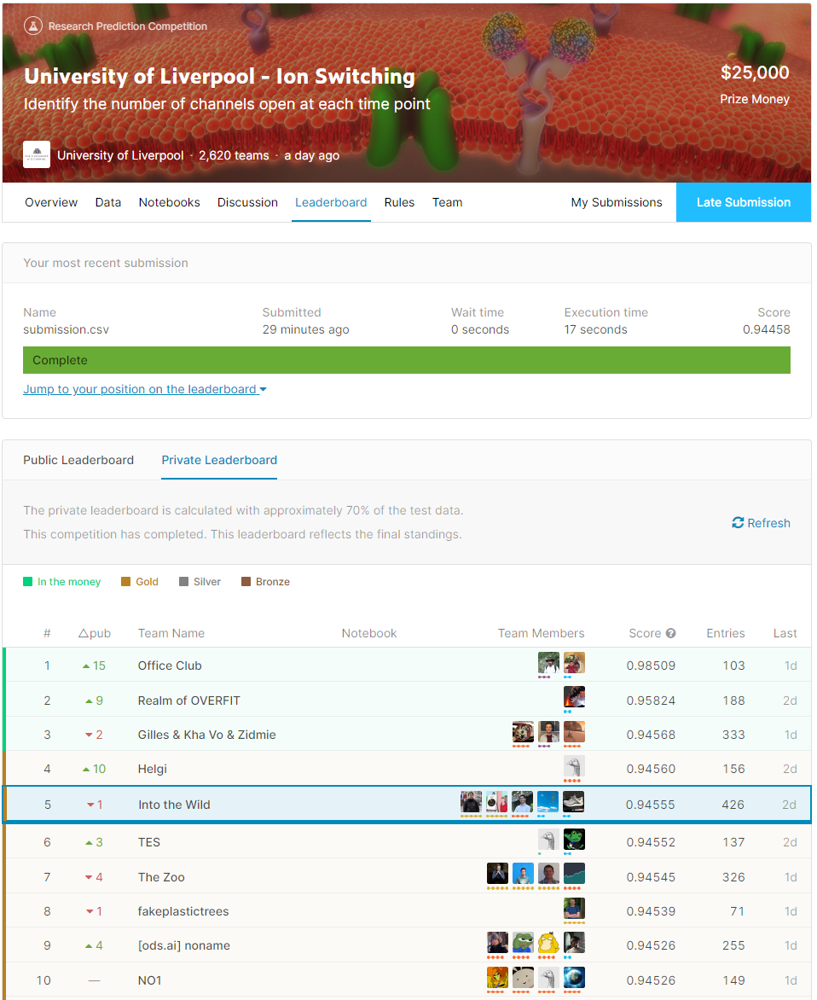

# 5th place solution to University of Liverpool - Ion Switching Kaggle Competition

University of Liverpool - Ion Switching Kaggle Competition finalized on 25th May 2020 with 2618 teams. 

Thanks to Kaggle team, organizers, Kaggle community for their contributions and my brilliant teammates [Giba](https://www.kaggle.com/titericz), [Ahmet](https://www.kaggle.com/aerdem4), [Skgone ](https://www.kaggle.com/skgone123) and [Alex ](https://www.kaggle.com/lihuajing)for their efforts. It was real fun to work with them.

This is the brief summary of our final pipeline with the code for each step. Please visit the competition page for competition data and more details;
https://www.kaggle.com/c/liverpool-ion-switching/



### **1- Clean Dataset Creation** 
This is the first and most important step in our progress. Before we removed drift and other kind of noises by himself, we couldn't have reliable CV with the raw data. Other teams may set up a reliable CV on the raw data, but, it didn't work for us after some point. It's a bit hard to prevent overfitting on a synthetic and noisy dataset, especially when you are using multiple OOFs for stacking. Please see "remove-trends-giba-explained" notebook by [Giba](https://www.kaggle.com/titericz) for more details;

### **2- Data Augmentation** 
We found it useful to augment a new 10-channel batch by summing 5th and 8th batches because 10-channel batches are simply the sum of two 5-channel batches. To be more specific, it's sum of 2 different (5 HMM Bs + pink noise + white noise).

```
train['group'] = np.arange(train.shape[0])//500_000
aug_df = train[train["group"] == 5].copy()
aug_df["group"] = 10

for col in ["signal", "open_channels"]:
    aug_df[col] += train[train["group"] == 8][col].values

train = train.append(aug_df, sort=False).reset_index(drop=True)

```


### **3- Validation Scheme and OOF Creation** 
We used the same validation for all models including the ones for OOF creation, which is Group-5Fold over 4k sequences. This validation works fine with Giba's clean dataset. Before we don't trust this validation scheme, we were using 2-fold CV to test different things based on these groups divided equally in terms of batch types;
```
groups = [[0, 2, 3, 4, 5], [1, 6, 7, 8, 9]]

```
We tried 3 LGBs, 1 RFC, 1 MLP, 1 BiGRU, 1 KNN, 1 SVM for stacking. We used the same validation scheme and applied the same data augmentation above to create OOFs. Only 3 models' OOFs were added to the wavenet (click on model names to reach their notebooks);
- Random Forest Classifier, similar to [Sergey's](https://www.kaggle.com/sggpls) public kernel (thanks to Sergey for his contributions). We applied it on our own dataset and calculated lead/lag features grouping by 10-second batches to avoid leakage from other batches for both train and test. [(See; into-the-wild-rfc-classification.ipynb)](https://github.com/meminozturk/kaggle-ion-switching/blob/master/into-the-wild-rfc-classification.ipynb)
- Lightgbm Regression, simply the Lightgbm Regression version of the RFC model with same lead/lag features. [Alex](https://www.kaggle.com/lihuajing) had created this model before we teamed up. I tried hyperparameter optimization and increased its CV by 0.01, however, wavenet worked better with initial paramaters. [(See; into-the-wild-rlgb-regression.ipynb)](https://github.com/meminozturk/kaggle-ion-switching/blob/master/into-the-wild-lgb-regression.ipynb)
- MLP Regression, it's the MLP part of [Marcelo's ](https://www.kaggle.com/martxelo) kernel with some adjustments. [(See: into-the-wild-mlp-regression.ipynb)](https://github.com/meminozturk/kaggle-ion-switching/blob/master/into-the-wild-mlp-regression.ipynb)
 
### **4- Wavenet Model** 
#### **(Private Score: 0.94559 - Public Score: 0.94673)**
Our main model is wavenet like most teams and better version of [Trigram's ](https://www.kaggle.com/nxrprime) great kernel with some more tricks;
-Own dataset and OOFs
-No other signal-related features
-Simpler but effective Wavenet (tuned by [Ahmet](https://www.kaggle.com/aerdem4))
```
inp = Input(shape = (shape_))    
x = wavenet_block(inp, 16, 3, 8)
x = wavenet_block(x, 32, 3, 12)
x = wavenet_block(x, 64, 3, 4)
x = wavenet_block(x, 128, 3, 1)
out = Dense(11, activation = 'softmax', name = 'out')(x)    
model = models.Model(inputs = inp, outputs = out)
opt = Adam(lr = LR)
model.compile(loss = losses.CategoricalCrossentropy(), optimizer = opt, metrics = ['accuracy'])
```
-Simpler LR scheduler
-Used Best weights based on F1 Macro for prediction
-Test time flip augmentation added 
-Train time flip augmentation used as in the original kernel
-Sliding Window prediction (implemented by [Ahmet](https://www.kaggle.com/aerdem4))
```
def sliding_predict(model, x):
    pred = np.zeros((x.shape[0], 100_000, 11))
    for begin in range(0, 100_000, SLIDE):
        end = begin + GROUP_BATCH_SIZE
        pred[:, begin:end, :] += model.predict(x[:, begin:end, :])
    return pred
```

It scored 0.04559 which is better than our current private score without any blending. [(See; into-the-wild-wavenet.ipynb)](https://github.com/meminozturk/kaggle-ion-switching/blob/master/into-the-wild-wavenet.ipynb)

### **5-XGB Classifier for Submission** 
#### **(Private Score: 0.94555 - Public Score: 0.94686)**
Ahmet implemented an XGB Classifier to tune predictions from Wavenet. It's simply using signal, wavenet predictions and noise as features;
```
train['noise'] = train['signal'].values - train['wavenet_prediction'].values
test['noise'] = test['signal'].values - test['wavenet_prediction'].values

```
This step gave us a nice boost on public LB but, results are almost the same on private leaderboard without XGB. On the other hand, our best private submission was the result of this XGB model with a score of 0.94568 on private leaderbord. [(See; into-the-wild-xgb-submission.ipynb)](https://github.com/meminozturk/kaggle-ion-switching/blob/master/into-the-wild-xgb-submission.ipynb)

I hope you find it useful what we've done, which is open to play with.

Hope to see you in the upcoming competitions,
Emin
